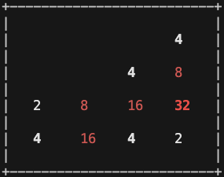

# LC-3 Virtual Machine

A complete implementation of the **LC-3 Virtual Machine** written in **C**, capable of executing real LC-3 object programs with support for memory-mapped I/O, keyboard input, and terminal interaction.

This project follows the LC-3 ISA and simulates the full fetch–decode–execute cycle, serving as a hands-on exploration of virtual machines and low-level systems programming.

---

## Demo

<p align="center">
  
</p>
<p align="center">
  <em>Example: 2048 running on the LC-3 Virtual Machine</em>
</p>

---

## Features

- Full LC-3 instruction set implementation  
- Memory-mapped I/O (keyboard and display)  
- Condition flags (N, Z, P) handling  
- TRAP routines (GETC, OUT, PUTS, IN, PUTSP, HALT)  
- Big-endian LC-3 object file loading  
- Terminal input buffering control (Unix/macOS)  
- Clean, readable C implementation  

---

## Building the VM

This project includes a **Makefile** for easy compilation.

Build the VM:
```bash
make
```

This produces the executable:
```bash
vm-vm
```

Clean build artifacts:
```bash
make clean
```

---

## Running the VM

The VM executes LC-3 `.obj` files.
```bash
./vm-vm path/to/program.obj
```

Example:
```bash
./vm-vm 2048.obj
```

If the program supports it, you may be prompted:
```
Are you on an ANSI terminal (y/n)?
```

Use WASD keys for games like 2048.

---

## Creating LC-3 Programs

You can write and assemble LC-3 programs using the official LC-3 simulator:

https://highered.mheducation.com/sites/0072467509/student_view0/lc-3_simulator.html

Assemble your program to generate a `.obj` file, then run it using this VM.

### Notes on Object Files

- `.obj` files are not included in this repository
- This keeps the repository clean and avoids redistributing third-party binaries
- Users are encouraged to assemble their own LC-3 programs or download public examples

### Example Programs

You can download pre-assembled LC-3 programs to test the VM:

- [2048 Game](https://www.jmeiners.com/lc3-vm/supplies/2048.obj)

---

## Platform Support

- macOS
- Linux
- Other Unix-like systems

Windows is not currently supported due to platform-specific terminal handling.

---

## Learning Outcomes

This project demonstrates:

- Virtual machine and emulator design
- Instruction decoding and execution
- Memory-mapped I/O
- Systems programming in C
- Low-level terminal control